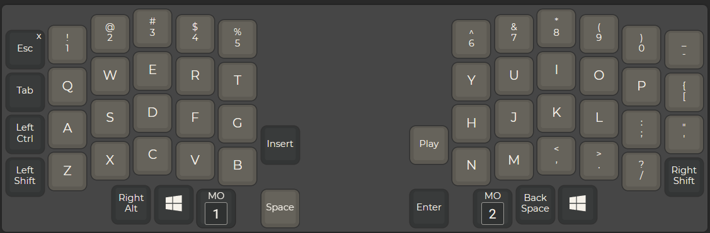
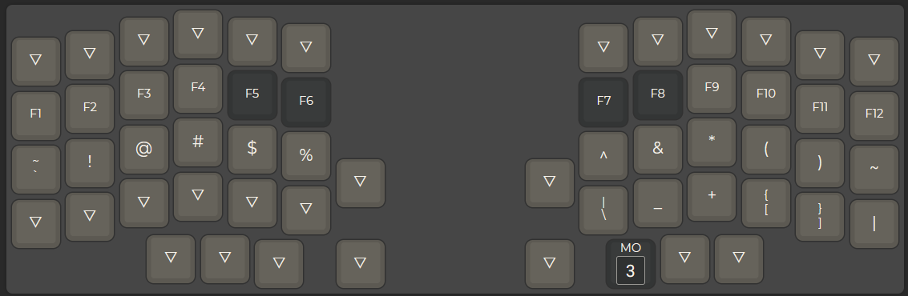
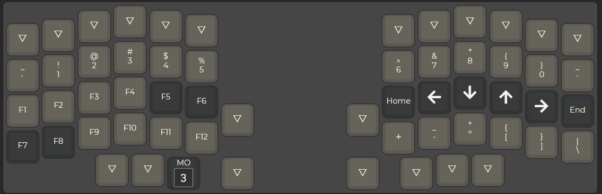
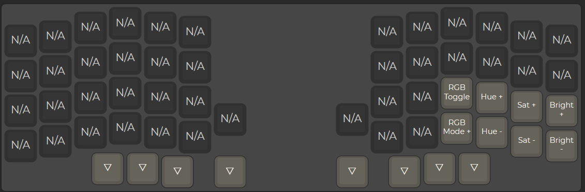

# Custom SeWiesa
# For german keyboard 
also include keymap_german.h in the file lily58.c
## File location
splitkb/aurora/lily58/keymaps
## compile
````qmk bash 
qmk compile -kb splitkb/aurora/lily58 -km JJW -e CONVERT_TO=liatris
````
## flash
````qmk bash
qmk flash -kb splitkb/aurora/lily58 -km JJW -e CONVERT_TO=liatris
````

##layout

##layer 1

##layer 2

##layer 3
